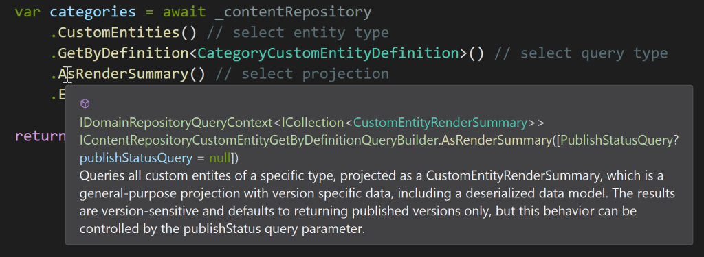

## IContentRepository

The recommended way to access Cofoundry data is by using one of our repository abstractions, which offer an easily discoverable fluent API enriched with inline documentation to help you choose the most suitable query or command for you needs. 

We'd recommend getting started with `IContentRepository`, which should be injected into your class using dependency injection:

```csharp
using Cofoundry.Domain;

public class ExampleController : Controller
{
    private readonly IContentRepository _contentRepository;

    public ExampleController(
        IContentRepository contentRepository
        )
    {
        _contentRepository = contentRepository;
    }

    [Route("/api/categories-example")]
    public async Task<IActionResult> Categories()
    {
        var categories = await _contentRepository
            .CustomEntities() // select entity type
            .GetByDefinition<CategoryCustomEntityDefinition>() // select query type
            .AsRenderSummary() // select projection
            .ExecuteAsync(); // execute

        return Json(categories);
    }
}
```

In this example we're using an MVC controller, but this will work anywhere that supports dependency injection. Note that XML comments are provided to help guide you towards the most suitable query or projection.



This fluent style of querying might look a little like the flexible querying used in Linq or Entity Framework, but this is different. Cofoundry data access is based around strongly typed queries and commands, and here we are actually just building a strongly typed query object and executing it.

While this approach isn't as flexible as a dynamic query builder framework like Entity Framework, it does allow us to provide a strong contract for what parameters we expect and what result you receive. This in turn enable us to hide the complexities of the underlying storage structure, provide more reliable performance, be more explicit about what we support and more easily communicate breaking changes.

### Mapping

A mapping function can be chained using a call to `Map`. Note that mapping functions are invoked after query execution, so this is really just a neater way of writing queries with mapped results.

```csharp
var entity = await _contentRepository
    .CustomEntities()
    .GetById(1)
    .AsRenderSummary()
    .Map(e => new
    {
        e.CustomEntityId,
        e.Title
    })
    .ExecuteAsync();
```

Items in collections and dictionaries can also be mapped with a call to `MapItem`, and `Map` can also be used to alter the collection. For dictionaries results, `FilterAndOrderByKeys` can be used to set the ordering of the results to match an existing key set:

```csharp
var ids = new int[] { 3, 1, 6 };
var entities = await _contentRepository
    .CustomEntities()
    .GetByIdRange(ids)
    .AsRenderSummaries()
    .MapItem(i => new { i.UrlSlug, i.Title })
    .FilterAndOrderByKeys(ids)
    .Map(r => r.Reverse())
    .ExecuteAsync();
```

## IAdvancedContentRepository

`IAdvancedContentRepository` includes everything that can be found in `IContentRepository`, but also includes additional queries and commands that are not needed by most sites.

```csharp
await _advancedContentRepository
        .PageDirectories()
        .AddAsync(new AddPageDirectoryCommand()
        {
            Name = "Products",
            UrlPath = "products",
            ParentPageDirectoryId = 1
        });
```

## Further Reading

Both content repositories inherit from `IDomainRepository`. This base interface includes a number of other features including:

- Query & command execution
- Permissions elevation
- Transaction management

Read more about these features in the [IDomainRepository docs](/framework/data-access/idomainrepository)

