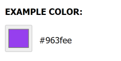
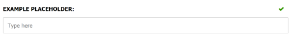

This section covers the following data annotations:

- [`[Color]`](#color)
- [`[Placeholder]`](#placeholder)

Each of these are explained below:

## [Color]

The `[Color]` data annotation can be used to decorate a `string` property and provide a UI hint to the admin interface to display a color picker field. 

The editor will validate a hexadecimal color value e.g. "#EFEFEF" or "#fff".

#### Example

```csharp
using Cofoundry.Domain;

public class ExampleDataModel : ICustomEntityDataModel
{
    [Color]
    public string ExampleColor { get; set; }
}
```

Output:



## [Placeholder]

The `[Placeholder]` data annotation can be used to provide a UI hint to the admin interface to add a [placeholder attribute](https://developer.mozilla.org/en-US/docs/Web/HTML/Element/Input#htmlattrdefplaceholder) in an html input field.

#### Example

```csharp
using Cofoundry.Domain;

public class ExampleDataModel : ICustomEntityDataModel
{
    [Placeholder("Type here")]
    public string ExamplePlaceholder { get; set; }
}
```

Output:

