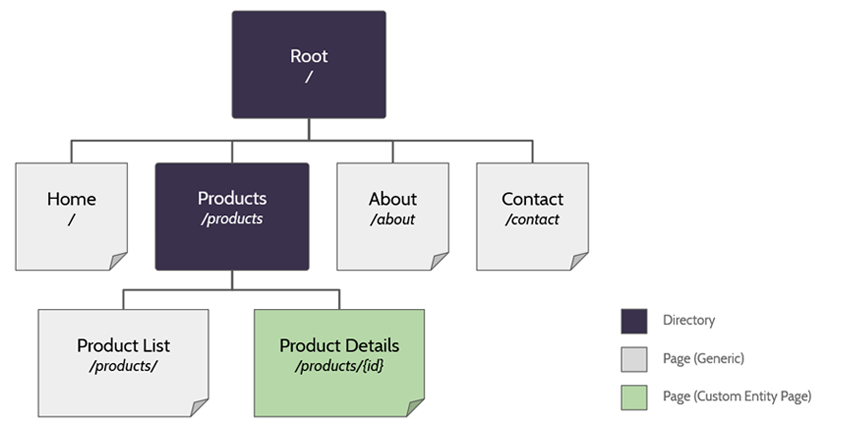
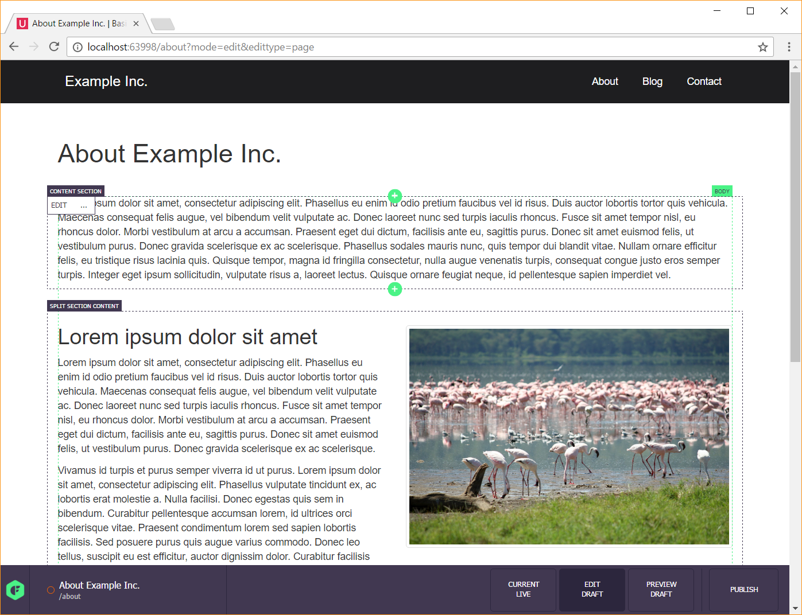

Cofoundry has content management features that let you create and manage your website pages dynamically. Pages use a flexible templating system that augments standard asp.net razor view files with modular content regions to provide you with fine grained control over your code and content.

To learn more about creating templates see the [page templates documentation](Page-Templates).

## Website Structure

Pages and directories are created and managed in the admin panel in the pages/directories sections.

#### Directories

All pages need to be parented to a directory and for most pages this will be the root directory. Directories aren't navigable and you'll need a page at the directory root if you want to display anything at the directory root.

#### Pages

Pages represent the dynamically navigable pages of your website. Each page uses a template which defines the regions of content that users can edit. Guidance on editing content is in the next section of this document.

#### Custom Entities

Pages are great for creating content represented by a single page (e.g a home page, about page or contact page), but for data used in multiple pages or as listable content (e.g. blog posts, products or store locations) you're better off creating a [Custom Entity](Custom-Entities).

A special [Custom Entity Page](Custom-Entity-Pages) page type can be used to render a page for each custom entity using a configurable routing rule. Check out the [documentation](Custom-Entity-Pages) for more information.

## Editing Content

While pages and directories can be managed in sections of the admin panel, editing page content is done inline while browsing the page. We refer to this inline editor as the **Visual Editor**. To use the visual editor simply browse to the page you want to edit while logged in and click on the *Edit Draft* button to start editing.

You build up page content by using *Regions* and *Blocks*. Your template will define areas of the page that can contain managed content, these are *Regions* and each region can contain 0 or more *Blocks*. 
When you define regions in your template you can specify whether the region allows multiple blocks and you can restrict the types of blocks that a user can place. We have some built-in block types, but you can easily create your own; a block type is just a razor view file and a .Net class.

For more detail on this see the documentation for [Page Templates](Page-Templates) and [Page Block Types](Page-Block-Types).

#### Content Flexibility

Cofoundry supports a wide range of content management styles. If you want to give content editors flexibility you can create more generic templates that allow a wide range of block types, or if you have a very specific design you can restrict block type choice so content editors can't break the design of the site. If you trust your content editors and you want to allow total freedom you can instead place a single region that allows the raw html block type.

