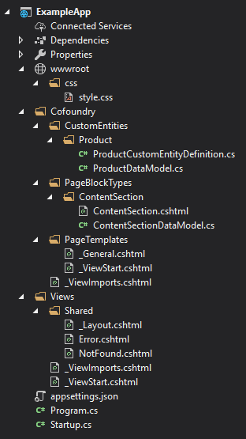
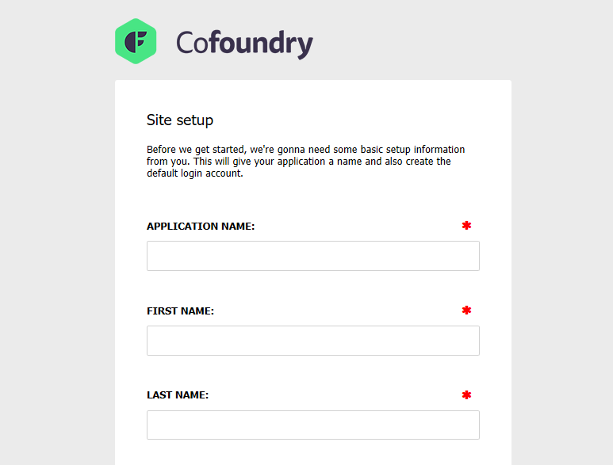

## Requirements

- .NET Standard 2.0 or later (e.g. .Net Core 2.0 or .Net Framework 4.6.1)
- For web projects ASP.NET 2.1 is required
- SqlServer (Express) 2012 or later, or Azure SqlServer

## Creating a new project using the .NET CLI

The simplest way to get started with Cofoundry is to create a web project using the `dotnet new` command line tool. This will create a basic website outline with some default plugins, startup code and example page templates, block types, custom entities and error pages.



#### Installation steps

1. Install the Cofoundry template package:

> dotnet new -i "Cofoundry.Templates::*"

2. Create a new project using the *cofoundry-web* template:

> dotnet new cofoundry-web -n ExampleApp

3. Create a new SQL Server database and amend the `Cofoundry:Database:ConnectionString` setting in your `appsettings.json` file to point to your new database.

4. Start the application and you will be greeted with the setup screen, use this to register an administrator account.



Congratulations, you've installed Cofoundry! Skip to the [Next Steps](#next-steps) section below for more information on what to do next. 

## Creating a new project manually

This is just an example of how you'd typically create a new site, but you can quite easily add Cofoundry to an existing site. Cofoundry database objects are namespaced under their own schema so there shouldn't be any issue with installing to an existing database.

### Creating the site

1. Open Visual Studio 2017 and create a new *ASP.NET Core Web Application* project using ASP.Net Core 2.1.

2. Choose the *Empty* project template.

3. Create an empty database in SQL Server.

4. Install the [Cofoundry.Web.Admin](https://www.nuget.org/packages/Cofoundry.Web.Admin/) NuGet package

### Configuring the site

The NuGet installation is intended to be unobtrusive to avoid causing conflicts with your existing configuration and settings, however, there are a few manual changes you'll need to make to your application to get up and running. 

1. Open your *appsettings.json* and add a connection string named 'Cofoundry' that points to the database you just created

```js
{
  "Cofoundry": {

    "Database": {
      "ConnectionString": "Server=.\\sqlexpress;Database=MyCofoundrySite;Integrated Security=True;MultipleActiveResultSets=True"
    }

  }
}
```

2. Amend your Startup.cs file to bootstrap Cofoundry:

Note that exception handling and static file handling is initialized by Cofoundry so we can remove these parts from the startup file.

```csharp
using Microsoft.AspNetCore.Builder;
using Microsoft.AspNetCore.Hosting;
using Microsoft.Extensions.DependencyInjection;
using Microsoft.Extensions.Configuration;
using Cofoundry.Web;

namespace MySite 
{
    public class Startup
    {
        public IConfiguration Configuration { get; }

        public Startup(IConfiguration configuration)
        {
            Configuration = configuration;
        }

        public void ConfigureServices(IServiceCollection services)
        {
            services.Configure<CookiePolicyOptions>(options =>
            {
                // This lambda determines whether user consent for non-essential cookies is needed for a given request.
                options.CheckConsentNeeded = context => true;
                options.MinimumSameSitePolicy = SameSiteMode.None;
            });
            
            // Register Cofoundry with the DI container. Must be run after AddMvc
            services
                .AddMvc()
                .AddCofoundry(Configuration);
        }

        public void Configure(IApplicationBuilder app, IHostingEnvironment env)
        {
            if (!env.IsDevelopment())
            {
                app.UseHsts();
            }

            app.UseHttpsRedirection();
            
            // Register Cofoundry into the pipeline. As part of this process it also initializes 
            // the MVC middleware and runs additional startup tasks.
            app.UseCofoundry();
        }
    } 
}
```

3. Ensure your Cofoundry project is compatible with view pre-compilation by setting `MvcRazorExcludeViewFilesFromPublish` and `MvcRazorExcludeRefAssembliesFromPublish` to false in your .csproj project file (see [deployment documentation](publishing-and-deployment) for reasons why):

```xml
<Project Sdk="Microsoft.NET.Sdk.Web">

  <PropertyGroup>
    <TargetFramework>netcoreapp2.1</TargetFramework>
    <MvcRazorExcludeViewFilesFromPublish>false</MvcRazorExcludeViewFilesFromPublish>
    <MvcRazorExcludeRefAssembliesFromPublish>false</MvcRazorExcludeRefAssembliesFromPublish>
  </PropertyGroup>
  
  <!-- other nodes removed for clarity -->
  
</Project>
```

4. Start the application and you will be greeted with the setup screen, use this to register an administrator account.
 
Congratulations, you've installed Cofoundry! 

## Next steps

Now that you've got Cofoundry up and running, you might want to start by creating some [pages](/content-management/pages) or defining some [custom entities](/content-management/custom-Entities).

If you're interested in mixing in standard ASP.NET controllers and views then you can do that to, but you might want to read up on [Cofoundry routing](/content-management/routing).  